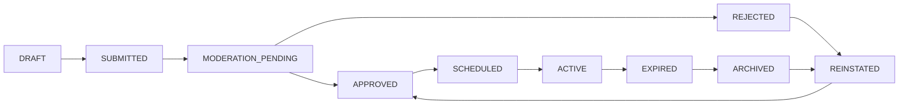

# Enhanced Digital Notice Board System

A sophisticated digital notice board application demonstrating advanced **Computer Science fundamentals** including Data Structures, Operating Systems concepts, and Theory of Computation principles.

## 🎯 Overview

This system goes beyond traditional notice boards to implement cutting-edge CS concepts:

- **Data Structures**: Hash maps, Bloom filters, Roaring bitmaps, Priority queues, Circular buffers, Timing wheels
- **Operating Systems**: Process scheduling, Concurrency control, IPC, Bounded buffers, State management
- **Theory of Computation**: Finite state machines, Regular languages, Complexity analysis, Decidability

## 🏗️ System Architecture

```
┌─────────────────┐    ┌──────────────────┐    ┌─────────────────┐
│   Frontend      │    │    Backend       │    │   Data Layer    │
│                 │    │                  │    │                 │
│ React + TS      │◄──►│ Express.js + TS  │◄──►│ In-Memory DS    │
│ Enhanced UI     │    │ Advanced APIs    │    │ + Database      │
│ Real-time       │    │ Socket.IO        │    │                 │
└─────────────────┘    └──────────────────┘    └─────────────────┘
```

## 🧮 Computer Science Concepts Implementation

### 1. Data Structures

#### **Audience Targeting Service** (`src/backend/services/audienceTargeting.ts`)
- **Hash Maps**: O(1) user attribute lookups
- **Inverted Index**: Fast search by tags/keywords
- **Roaring Bitmaps**: Efficient set operations for cohort selection
- **Bloom Filters**: Probabilistic "has user seen notice?" checks

```typescript
// Example: Audience targeting with bitmaps
const eligibleUsers = deptBitmap["engineering"] & locationBitmap["campus-5"];
eligibleUsers.and(roleBitmap["developer"]);
```

#### **Notice Scheduler** (`src/backend/services/noticeScheduler.ts`)
- **Priority Queue (Binary Heap)**: O(log n) priority-based scheduling
- **Timing Wheel**: O(1) amortized timer management
- **Circular Buffers**: Lock-free display pipelines
- **Interval Trees**: Overlapping time window detection

```typescript
// Example: Priority queue operations
insertIntoPriorityQueue(notice); // O(log n)
const nextNotice = extractMin();  // O(log n)
```

### 2. Operating Systems Concepts

#### **Process Scheduling**
- **Multi-queue scheduling**: Separate queues per priority level
- **Preemptive scheduling**: Emergency notices interrupt normal flow
- **Weighted fair queuing**: Per-tenant resource allocation

#### **Concurrency Control**
- **Optimistic concurrency**: Version vectors for conflict detection
- **Lock-free data structures**: Circular buffers for high throughput
- **Atomic operations**: CAS for state transitions

#### **Bounded Buffers & IPC**
- **Producer-Consumer**: Notice creation → validation → dispatch
- **Message passing**: Inter-service communication via events
- **Backpressure**: Flow control when buffers are full

### 3. Theory of Computation

#### **Finite State Machine** (`src/backend/services/noticeStateMachine.ts`)
- **Deterministic FSM**: δ(state, input) → state′
- **Guard conditions**: Role-based and time-based constraints
- **Audit logging**: Complete transition history

```
States: DRAFT → SUBMITTED → MODERATION_PENDING → APPROVED → SCHEDULED → ACTIVE → EXPIRED → ARCHIVED
```

#### **Regular Languages**
- **Audience expressions**: Constrained to regular language for decidability
- **Topic filters**: Regex-based subscription patterns
- **DFA compilation**: Once per rule for O(1) membership tests

#### **Complexity Guarantees**
- **Targeting**: O(n/word-size) bitmap operations
- **Scheduling**: O(log m) heap operations
- **Deduplication**: O(k) Bloom filter lookups
- **Routing**: O(1) consistent hashing

## 🚀 Key Features

### **Real-time Audience Targeting**
- Bitmap-based cohort selection
- Inverted index search
- Bloom filter deduplication
- O(1) membership tests

### **Priority-based Scheduling**
- Emergency notice preemption
- Deadline-aware scheduling
- Timing wheel optimization
- Circular buffer pipelines

### **State Machine Workflows**
- Deterministic state transitions
- Guard condition evaluation
- Audit trail maintenance
- FSM validation

### **System Observability**
- Real-time statistics dashboard
- Data structure metrics
- Performance monitoring
- FSM visualization

## 🛠️ Technical Stack

### Backend
- **Node.js + Express.js**: RESTful API server
- **TypeScript**: Type-safe development
- **Socket.IO**: Real-time communication
- **Advanced Data Structures**: Custom implementations
- **In-memory storage**: High-performance operations

### Frontend
- **React 18**: Component-based UI
- **TypeScript**: Type safety
- **Tailwind CSS**: Utility-first styling
- **Real-time updates**: WebSocket integration
- **Responsive design**: Mobile-first approach

## 📊 System Statistics Dashboard

The admin panel provides real-time insights into:

- **Audience Targeting**: User counts, bitmap efficiency, Bloom filter statistics
- **Scheduler**: Queue sizes, active notices, timer wheel utilization
- **State Machine**: Transition counts, state distribution, FSM validation

## 🔄 Notice Lifecycle (FSM)



## 🎯 Performance Characteristics

| Operation | Time Complexity | Space Complexity |
|-----------|----------------|------------------|
| User targeting | O(n/w) | O(n/w) |
| Priority insertion | O(log m) | O(m) |
| Bloom filter check | O(k) | O(m) |
| State transition | O(1) | O(1) |
| Timer wheel tick | O(1) amortized | O(t) |

Where: n = users, m = notices, w = word size, k = hash functions, t = time slots

## 🚦 Getting Started

### Prerequisites
- Node.js 18+
- npm/yarn
- PostgreSQL (optional)

### Installation

1. **Install dependencies:**
```bash
npm run install-all
```

2. **Set up environment:**
```bash
cp .env.example .env
# Edit .env with your configuration
```

3. **Start development servers:**
```bash
npm run dev
```

The enhanced system will be available at:
- Frontend: http://localhost:3000
- Backend API: http://localhost:3001
- Enhanced API: http://localhost:3001/api/enhanced-notices

### Usage

1. **Register/Login** to access the system
2. **Create notices** with advanced targeting options
3. **View real-time statistics** in admin panel
4. **Monitor FSM transitions** and system health
5. **Test emergency preemption** with high-priority notices

## 🧪 Advanced Features Demo

### Audience Targeting
```typescript
// Register users with attributes
POST /api/enhanced-notices/register-user
{
  "userId": "user123",
  "department": "Engineering",
  "role": "Developer",
  "location": "Building A",
  "tags": ["backend", "urgent"]
}

// Create targeted notice
POST /api/enhanced-notices
{
  "title": "System Maintenance",
  "audienceRule": {
    "departments": ["Engineering"],
    "roles": ["Developer"],
    "tags": ["backend"]
  }
}
```

### Emergency Preemption
```typescript
// Activate emergency notice (bypasses all queues)
POST /api/enhanced-notices/{id}/emergency
```

### System Statistics
```typescript
// Get real-time system metrics
GET /api/enhanced-notices/system/stats
{
  "audienceTargeting": { "totalUsers": 150, "bloomFilterElements": 1024 },
  "scheduler": { "queueSize": 5, "activeNotices": 12 },
  "stateMachine": { "validTransitions": 98, "invalidTransitions": 2 }
}
```

## 🔍 Monitoring & Debugging

### FSM Visualization
- Export state machine as DOT graph
- Validate FSM completeness and correctness
- Monitor invalid transition attempts

### Performance Metrics
- Bitmap operation efficiency
- Priority queue performance
- Bloom filter false positive rates
- Timer wheel utilization

### Real-time Dashboard
- Live system statistics
- Active notice monitoring
- User engagement metrics

## 🎓 Educational Value

This project demonstrates:

1. **Practical application** of theoretical CS concepts
2. **Performance optimization** through proper data structure selection
3. **System design** with scalability and reliability in mind
4. **Real-world implementation** of academic algorithms
5. **Production-ready code** with proper error handling and monitoring

## 🤝 Contributing

This is an educational project showcasing CS fundamentals. Contributions are welcome to:

- Add more data structure implementations
- Enhance the FSM with additional states
- Improve performance monitoring
- Extend audience targeting capabilities

## 📚 References

- **Data Structures**: Cormen, Leiserson, Rivest, Stein (CLRS)
- **Operating Systems**: Silberschatz, Galvin, Gagne
- **Theory of Computation**: Sipser
- **System Design**: Designing Data-Intensive Applications (Kleppmann)

---

**Built with ❤️ to demonstrate the beauty and power of Computer Science fundamentals in real-world applications.**
